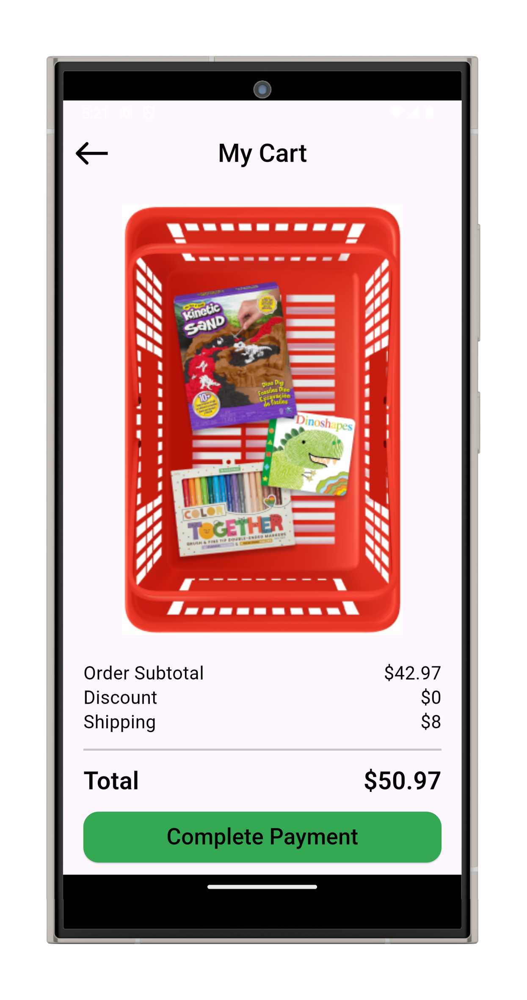
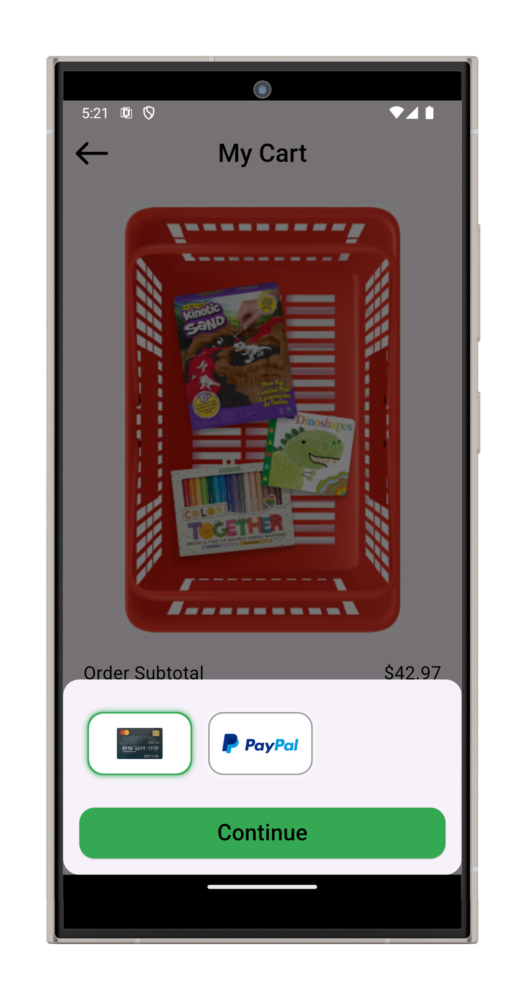
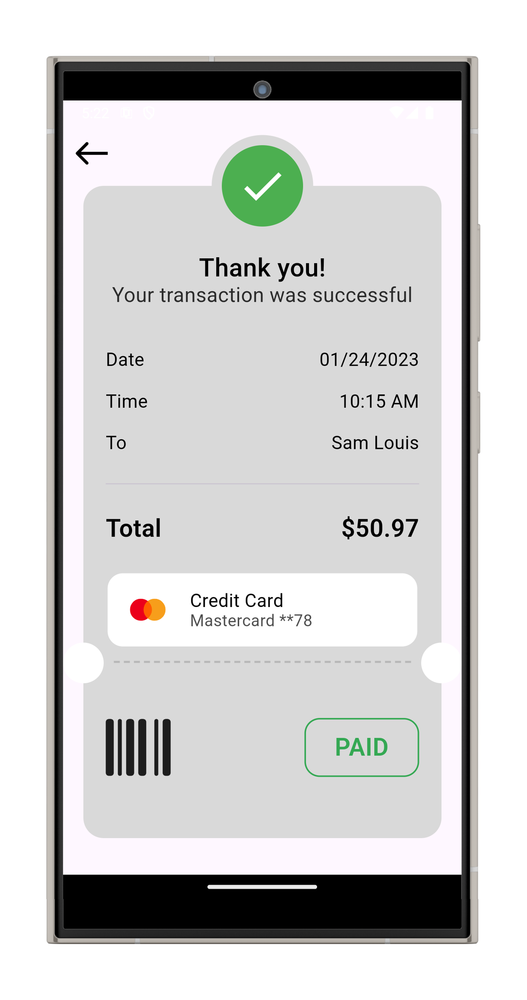
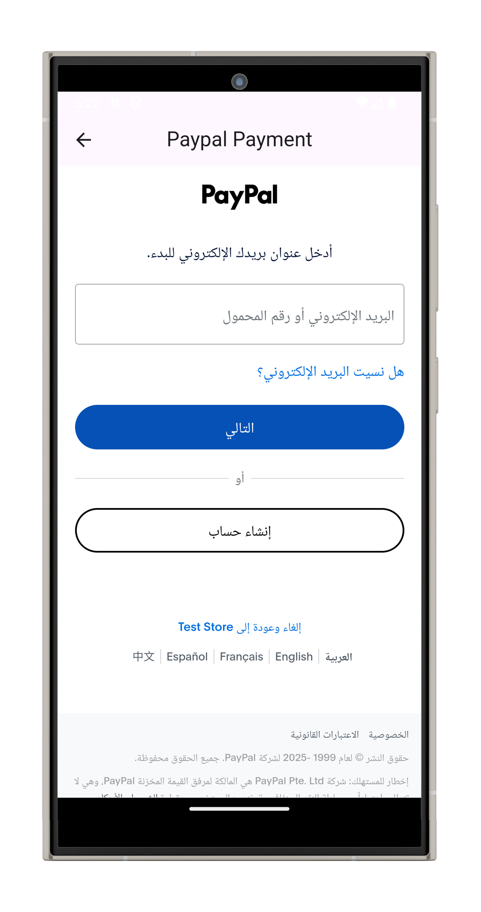

# 💳 Flutter Payment App (Stripe & PayPal)

A Flutter application that supports secure and easy payments using **Stripe** and **PayPal**. This app demonstrates how to integrate multiple payment gateways in a clean, scalable, and modular way.

## 🚀 Features

- 💰 Stripe payment integration
- 🅿️ PayPal payment integration
- 🔐 Secure payment flow
- 🧠 Bloc/Cubit state management (optional)
- 📦 Uses latest payment SDKs and APIs
- 📱 Clean and responsive UI

## 🖼 Screenshots

  
  
  
  
  
  
</div
